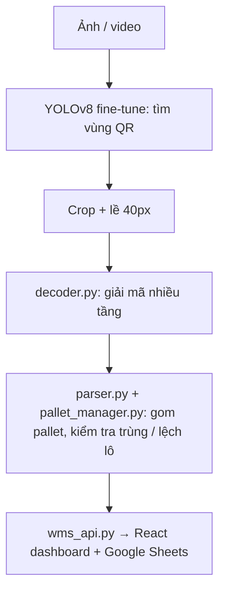

# AI Camera Vision — Quét mã QR & xác thực pallet trong kho

Hệ thống nhận ảnh hoặc video (camera giám sát, drone, điện thoại) của pallet hàng, tự tìm và đọc
tất cả nhãn QR trên thùng carton, gom thành pallet theo quy tắc kho và đồng bộ lên Google Sheets.

> Hướng dẫn cài đặt & chạy: [README_1.md](README_1.md) · Triển khai lên server: [DEPLOY.md](DEPLOY.md) · Frontend: [warehouse-management/README.md](warehouse-management/README.md) · Train lại YOLO: [training/README.md](training/README.md)

---

## Kiến trúc

| Thành phần | File | Vai trò |
|---|---|---|
| Phát hiện QR | `weights/best_v2.pt` | YOLOv8n fine-tune cho nhãn nhỏ trên carton + QR in trên bao bì |
| Giải mã | `decoder.py` | zxing-cpp + tiền xử lý + khử nhòe, dừng ngay khi đọc được |
| Nghiệp vụ | `parser.py`, `pallet_manager.py` | Tách `carton_id\|product_code\|lot_batch\|MM-YYYY`, gom theo sản phẩm, chặn trùng |
| API | `wms_api.py` | FastAPI: quét ảnh/video, stream MJPEG, đồng bộ Sheets |
| Giao diện | `warehouse-management/` | React: Upload → Scan → Finalize |
| CLI | `main.py` | Quét cả thư mục ảnh offline, xuất `output.json` |
| Train | `training/` | Sinh dataset, fine-tune, so sánh model |

### Pipeline giải mã (`decoder.py`)

Mỗi crop chạy lần lượt các tầng, **dừng ngay khi đọc được**, nên ảnh rõ nét chỉ tốn vài ms:

1. **zxing-cpp** trên ảnh xám gốc
2. **WeChat QR** (CNN + super-resolution), chỉ khi cài `opencv-contrib` và có model trong `weights/wechat/`
3. **Tiền xử lý**: lọc median (nhiễu muối tiêu), phóng to 3–8 lần + nhị phân/làm nét (mã rất nhỏ), unsharp, CLAHE, Otsu/adaptive threshold
4. **Khử nhòe chuyển động**: ước lượng hướng nhòe từ gradient, Wiener deconvolution với bộ kernel đã chọn sẵn

Hai lớp bảo vệ ở tầng 3–4: crop lớn hơn 800px được thu nhỏ trước (tránh tốn ~10s cho box YOLO bắt nhầm cả khung hình),
và mã ngắn hơn 6 ký tự bị loại (tiền xử lý mạnh đôi khi "bịa" ra mã kiểu `6434` từ nhiễu).

### Video (`wms_api.py → scan_video`)

- Lấy mẫu 1 frame/giây, bỏ qua frame gần như không đổi so với frame vừa quét
- `CropCache`: QR đứng yên không bị decode lại; vùng YOLO bắt nhầm chỉ thử lại mỗi 2 giây
- Chạy trong thread riêng, server vẫn phục vụ stream MJPEG trong lúc quét
- Lưu frame bằng chứng cho từng mã → bấm vào mã ở bước Finalize thấy đúng chỗ mã được đọc

---

## Kết quả đo (máy CPU, không GPU)

Đo trên `images/clean/`, `images/test/` và 9 ảnh kho thật `images/z77*.jpg`.

| Chỉ số | Bản đầu | Hiện tại |
|---|---|---|
| Crop QR giải mã được | 147/258 (57%) | **204/258 (79%)** |
| Thời gian decode trung bình / crop | ~1470 ms | **~70–160 ms** |
| Mã đọc đúng end-to-end (YOLO + decode)¹ | — | **209/231 (90.5%)** |
| Box YOLO không ra mã trên ảnh carton | — | **giảm 30–40%** (model v2 so với model gốc) |
| Video DJI 163s / VideoCam 234s | > 10 phút, đứng server | **~35s / ~40s** |

¹ "Đáp án" = mọi mã từng đọc được ở mỗi cảnh (các ảnh `real_dataN_*` là cùng một cảnh). Mã không đọc được bằng
bất kỳ cách nào thì không nằm trong đáp án, nên con số này là tỉ lệ so với giới hạn hiện tại, không phải so với số nhãn thật.

### Giới hạn đã biết

- **QR quá nhỏ**: dưới ~2px mỗi ô (ví dụ nhãn rộng ~25px trong ảnh kho chụp xa, gửi qua Zalo) thì không bộ giải mã nào đọc được.
  Cần chụp gần hơn / camera độ phân giải cao hơn để QR rộng ≥ 60–75px.
- **Nhòe dọc rất mạnh** (vệt nhòe 3–4 ô QR, ảnh `*_blur_motion_90`) phần lớn không cứu được.
- **Định dạng mã**: `parser.py` chỉ nhận `carton_id|product_code|lot_batch|MM-YYYY`. Nhãn thật hiện tại (`AKAH312302301`,
  `00950178-1`, link `http://qr.ionlife…`) vẫn được đọc và hiện trong bảng **QR CODES**, nhưng chưa được gom vào pallet.
- **Bước 3 chỉ có nút "XÁC NHẬN"**: tạm thời chỉ xác nhận trên giao diện, chưa lưu hay đồng bộ Google Sheets.

---

## Công nghệ

Python 3.11 · FastAPI · Ultralytics YOLOv8 · OpenCV · zxing-cpp · NumPy · React (Create React App) · Google Sheets (gspread)
